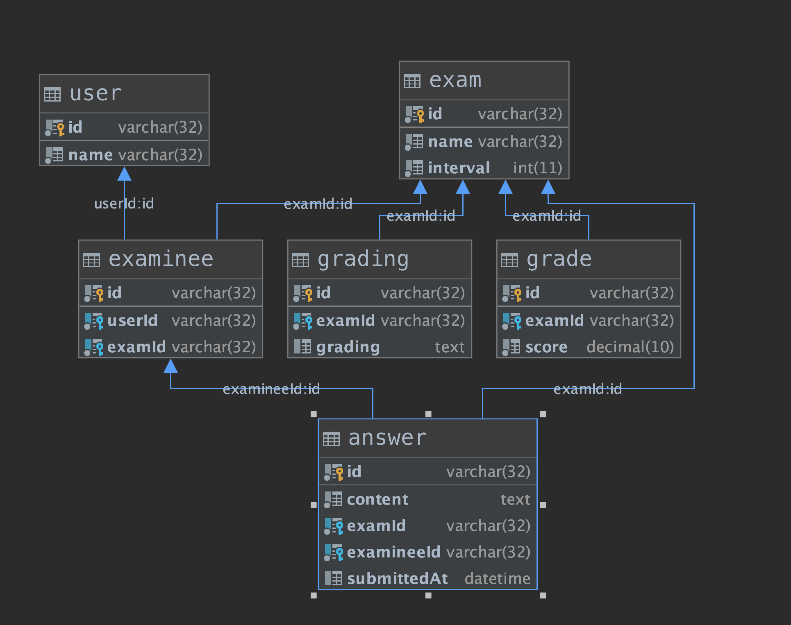

##### 技术栈

- Java

- SpringBoot

- SpringBoot Test

- Docker

- BDD Mockito

- Junit4

- Mysql

- Embdded H2

- Flyway

  

##### 系统架构


##### 测试架构及工序


##### ER图




##### Story

| As      | I would like to                | so that                          |
| ------- | ------------------------------ | -------------------------------- |
| student | 我可以获取到学生最新提交的答案 | 我可以用最新答案给学生打分       |
| student | 我可以修改考试时长             | 我可以根据不同的考试时长测试学生 |
| student | 我可以根据打分标准给学生打分   | 我可以公平的给学生打分           |


#### 我可以获取到学生最新提交的答案

##### 学生1可以正常提交答案a b c，学生1再次正常提交答案b c d，老师T1可查看到学生1的答案为b c d

##### POST /exams/1/examinees/1/answers 使用答案 a b c，返回201

```
  answer: {
    id: "A1"
  	content: "b c d",
  	examineeId: "1",
  	submittedAt: new Date(),
  }
  Stub ExamService::submitAnswer,测试Examcontroller，返回201
  Stub AnswerRepository::save方法,测试ExamService::submitAnswer，成功调用
  通过fakeDB检查，测试answerRepository::save方法，测试插入answer正确
```

##### POST /exams/1/examinees/1/answers  使用答案 b c d，返回201

```
  answer1: {
    id: "A1"
  	content: "b c d",
  	examineeId: "1",
  	submittedAt: new Date(),
  }
  
  answer2: {
    id: "A1"
  	content: "a b c",
  	examineeId: "1",
  	submittedAt: new Date(),
  }
  Stub ExamService::submitAnswer,测试Examcontroller，返回201
  Stub AnswerRepository::save方法,测试ExamService::submitAnswer时，成功调用
  通过fakeDB检查，测试answerRepository::save方法，answerRepository 插入answer1正确，answerRepository 插入answer2正确
```

##### GET /exams/1/examinees/1/answers  返回200，带有答案 b c d

```
 answer1: {
    id: "A1"
  	content: "b c d",
  	examineeId: "1",
  	submittedAt: new Date(),
  }
  
  answer2: {
    id: "A1"
  	content: "a b c",
  	examineeId: "1",
  	submittedAt: new Date(),
  }
Stub ExamService::findAnswerByExamineeId方法,测试controller，返回answer1对象，带有答案b c d
Stub AnswerRepository::findByExamIdAndExamineeId，测试ExamService::findAnswerByExamineeId时，返回answer1对象，带有答案 b c d
通过fakeDB检查，先注入一条answer2，再注入一条answer1数据，测试answerRepository::findByExamIdAndExamineeId时，返回answer1对象
```


#### 我可以修改考试时长

#### 例如: 老师T1可以修改考试时长为60分钟，学生在考试开始的60分钟以内可以提交答案，学生在考试开始的60分钟之后不允许提交答案

##### PUT /exams/1 返回200

```
exam: {
	id: 1,
	name: "考试",
	interval: 60
}
Stub ExamService::edit方法,测试controller,，返回200
Stub ExamRepository::edit方法,测试examRepository::edit(exam)时，返回200
通过fakeDB检查，测试ExamRepository::edit方法，edit(exam)时，操作成功
```


##### POST  /exams/1/examinees/1/answers 返回201

```
answer: {
    id: "A1"
  	content: "b c d",
  	examineeId: "S1",
  	submittedAt: new Date(),
  }
exam: {
	id: 1,
	name: "考试",
	interval: 60
}

  Stub ExamService::submitAnswer方法,当ExamService::submitAnswer(a b c)时，返回201
  Stub ExamRepository::findById(1)方法,测试ExamService::findById(1)时，返回一个开始时间在60分钟以内的exam对象。
  Stub AnswerRepository::save(answer)方法,测试ExamService::save(answer)时，成功调用
  通过fakeDB检查，注入一条exam数据，当findById(1)时，返回对应对象。通过answerRepository插入answer成功
```


##### POST  /exams/1/examinees/1/answers 返回400，提示考试时间已过，无法提交

```
exam: {
	id: 1,
	name: "考试",
	interval: 60
}  
  Stub ExamService::submitAnswer方法,当ExamService::submitAnswer(a b c)时，返回400
  Stub ExamRepository::findById(1)方法,测试ExamService::findById(1)时，返回一个开始时间在60分钟之外的exam。
  通过fakeDB检查，注入一条exam的数据，当findById(1)时，返回对应对象。
```


#### 我可以根据不同打分标准公平的学生打分

#### 例如：老师T1可以根据评分标准G1给学生A打分80分，老师T1可以根据评分标准G2给学生A打分90分

##### GET exams/1/gradings 返回200并带有评分标准G1

```
Stub ExamService::findGradingByExamId方法,测试controller，当findGradingByExamId时，返回grading，包含评分标准G1
Stub GradingRepository::findGradingByExamId方法，测试ExamService::findGradingByExamId，当findGradingByExamId时，返回grading对象，包含评分标准G1
通过fakeDB检查，注入一条grading数据，测试GradingRepository::findGradingByExamId时，返回对应对象
```

##### POST exams/1/examinee/1/grades 返回200

```
grade: {
	id: "1",
	examineeId: "1",
	score: 80
}
Stub ExamService::submitGrade方法,测试controller返回200
Stub GradeRepository::submitGrade方法，测试ExamService::submitGrade，操作成功
通过fakeDB检查，测试GradeRepository::insert成功插入grade对象
```

##### GET exams/1/examinee/1/grades 返回200，分数为80分

```
grade: {
	id: "1",
	examineeId: "1",
	score: 80
}
Stub ExamService::findGradeByExamnieeId方法,测试controller返回200，并带有学生考试得分80分
Stub GradeRepository::findGradeByExamnieeId方法，测试ExamService::findGradeByExamnieeId返回grade对象包含80分
通过fakeDB检查，注入一条grade数据，测试GradeRepository::findGradeByExamnieeId返回对应对象
```

##### PUT exams/1/gradings/1 返回200

```
grading: {
  id: 1,
  grading: "G2",
  examId: 1
}
Stub ExamService::updateGradingExamId方法,测试controller返回200
Stub GradingRepository::updateGradingExamId，测试ExamService::updateGradingExamId操作成功
通过fakeDB检查，测试gradingRepository::insert，成功插入grading对象
```


##### GET exams/1/gradings 返回200并带有评分标准G2

```
grading: {
  id: 1,
  grading: "G2",
  examId: 1
}
Stub ExamService::findGradingByExamId方法,测试controller，返回grading，包含评分标准G2
Stub GradingRepository::findGradingByExamId，测试ExamService::findGradingByExamId，返回grading对象，包含评分标准G2
通过fakeDB检查，注入一条grading数据，测试GradingRepository::findGradingByExamId，返回对应对象
```

##### POST exams/1/examinee/1/grades 返回200

```
grade: {
	id: "1",
	examineeId: "1",
	score: 90
}
Stub ExamService::submitGrade方法,测试controller，返回200
Stub GradeRepository::submitGrade方法，测试GradeRepository::submitGrade，操作成功
通过fakeDB检查，测试GradeRepository::insert,成功插入grade对象
```

##### GET exams/1/examinee/1/grades 返回200，分数为90分

```
grade: {
	id: "1",
	examineeId: "1",
	score: 90
}
Stub ExamService::findGradeByExamnieeId方法,测试controller，返回200，并带有学生考试得分90分
Stub GradeRepository::findGradeByExamnieeId方法，测试ExamService::findGradeByExamnieeId时，返回grade对象包含90分
通过fakeDB检查，注入一条grade数据，测试GradeRepository::findGradeByExamnieeId，返回对应对象
```


#### 我可以根据同一个打分标准对不同学生的相同答案打出相同的分数

#### 学生A和学生B的答案相同时，老师T1可以根据评分标准G1给学生A打分80分，老师T1可以根据评分标准G1给学生B打分80分

##### GET exams/1/examinee/1/answers 返回200，答案为a b c

```
answer: {
	id: 1,
	content: "a b c",
	examineeId: "1",
	submittedAt: new Date()
}
Stub ExamService::findAnswerByExamnieeId方法，测试controller，返回200，包含答案a b c
Stub AnswerRepository::findAnswerByExamnieeId方法，测试ExamService::findAnswerByExamnieeId，返回answer对象，包含答案a b c
通过fakeDB检查，注入一条answer数据，测试AnswerRepository::findAnswerByExamnieeId时返回对应对象
```

##### GET exams/1/examinee/2/answers 返回200，答案为a b c

```
answer: {
	id: 1,
	content: "a b c",
	examineeId: "2",
	submittedAt: new Date()
}
Stub ExamService::findAnswerByExamnieeId方法，测试controller时，返回200，包含答案a b c
Stub AnswerRepository::findAnswerByExamnieeId方法，测试ExamService::findAnswerByExamnieeId时，返回answer对象，包含答案a b c
通过fakeDB检查，注入一条answer数据，测试AnswerRepository::findAnswerByExamnieeId时返回对应对象
```

##### GET exams/1/gradings 返回200并带有评分标准G1

```
grading: {
  id: 1,
  grading: "G1",
  examId: 1
}
Stub ExamService::findGradingByExamId方法,测试controller时，返回grading，包含评分标准G1
Stub GradingRepository::findGradingByExamId方法，测试ExamService::findGradingByExamId时，返回grading对象，包含评分标准G1
通过fakeDB检查，注入一条grading数据，测试GradingRepository::findGradingByExamId时，返回对应对象
```

##### POST exams/1/examinee/1/grades 返回200

```
grade: {
	id: "1",
	examineeId: "1",
	score: 80
}
Stub ExamService::submitGrade方法,测试controller时，返回200
Stub GradeRepository::submitGrade方法，测试ExamService::submitGrade时，操作成功
通过fakeDB检查，测试GradeRepository::submitGrade成功插入grade对象
```

##### GET exams/1/examinee/1/grades 返回200，分数为80分

````
grade: {
	id: "1",
	examineeId: "1",
	score: 80
}
Stub ExamService::findGradeByExamnieeId方法,测试controller时，返回200，并带有学生考试得分80分
Stub GradeRepository::findGradeByExamnieeId方法，测试ExamService::findGradeByExamnieeId时，返回grade对象包含80分
通过fakeDB检查，注入一条grade数据，测试GradeRepository::findGradeByExamnieeId时，返回对应对象
````

##### POST exams/1/examinee/2/grades 返回200

```
grade: {
	id: "1",
	examineeId: "2",
	score: 80
}
Stub ExamService::submitGrade方法,测试controller时，返回200
Stub GradeRepository::submitGrade方法，测试ExamService::submitGrade时，操作成功
通过fakeDB检查，测试GradeRepository::insert时，成功插入grade对象
```

##### GET exams/1/examinee/S2/grades 返回200，分数为80分

````
grade: {
	id: "1",
	examineeId: "2",
	score: 80
}
Stub ExamService::findGradeByExamnieeId方法,测试controller时，返回200，并带有学生考试得分80分
Stub GradeRepository::findGradeByExamnieeId方法，测试ExamService::findGradeByExamnieeId时，返回grade对象包含80分
通过fakeDB检查，注入一条grade数据，测试GradeRepository::findGradeByExamnieeId时，返回对应对象
````


#### 代码截图

#### controller test


##### Service test


##### Repository test

